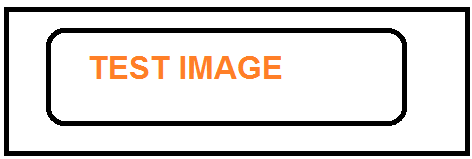

# This is Heading
This is description
## This is sub heading
This is description 2
- this is bullet point 1
- this is bullet point 2
    - one more bullet point 
    - one more bullet point
## Other Sub heading
This is **Bold** and this is *italic*
Below is you tube video link , need to add **Youtube Video ID** and **title**
[](http://www.youtube.com/watch?v=NOB4vr5S5zQ "Video Title")
Now Below is link
[link to Google!](http://google.com)

Below is Image ! will display image and ! is removed image link with text is displayed


## Codeing 
**Code**
```code
int a = 0;
a++;
```
**HTML**
```html
<style>*{position:relative}</style><table><input></table>
```
**JAVA**
```java
a = c.get()
```
**PYTHON**
```python
global a = "Nand"
print("hi" + a)
```

## Task List
- [x] this is a complete item
- [ ] this is an incomplete item
- [ ] this is an incomplete item

## Table
You can create tables by assembling a list of words and dividing them with hyphens - (for the first row), and then separating each column with a pipe |:

First Header | Second Header
------------ | -------------
Content from cell 1 | Content from cell 2
Content in the first column | Content in the second column

~~This is to cross the word~~

### writing quata
>Once upon a time and a very good time it was there was a moocow coming down along the road and this moocow that was coming down along the road met a nicens little boy named baby tuckoo...

### paragraph or new line is just **Two space characters** at end of each line..  they are invisoble
Do I contradict myself?  
Very well then I contradict myself,  
(I am large, I contain multitudes.)


```sequence
Alice->Bob: Hello Bob, how are you?
Note right of Bob: Bob thinks
Bob-->Alice: I am good thanks!
?```
