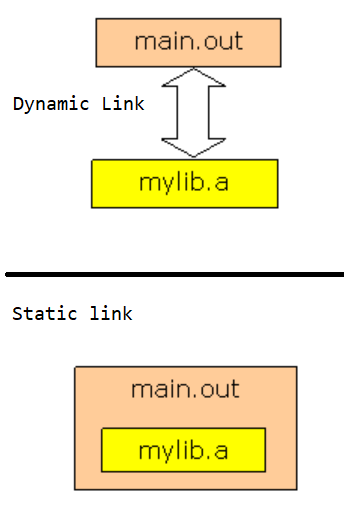

# How to create a library file in Linux

Library file is a group of compiled object files saved with .a file extension in case of Linux. Generally functions, enumerations, user defined types and constants shared by more than one application are broken out of the application source code, compiled and bundled as a library file. All the predefined functions are managed in standard libraries of gcc. We can also create our own library and can be used in any application. The main advantages with libraries are

1) Same library can be shared by multiple applications
2) Vendors can release libraries as APIs (Application Program Interface)
3) It reduces the applications source size and saves the compilation time
4) We no need to specify different object files while linking to make a build

## Static lib creation steps

Create 2 programs 

```code
int adding(int x,int y)
{
  return x+y;
}
```


```code
int adding(int x,int y)
{
  return x+y;
}

```

Compile and generate object files of both .c files using gcc compiler
-c is an option to generate only object files with .o file extension

```code
$gcc –c first.c second.c
```

Create the library file using archive tool ar. It groups all the object files and generates a library file with .a file extension.
-c is an option to create a new archive
-r is an option to replace an existed archive if existed with the same name
-v to verbose (display) the contents of library

```code
$ar –crv mylib.a first.o second.o
```

-t is an option to display the contents of a library file

```code
$ar –t mylib.a
```

 Create a header file with the prototypes of library functions and save with .h file extension
 
```code
int adding(int,int);
int subtraction(int,int);
 ```
 
We can use both the library functions and header file in any C program within the same folder

```code 
#include<stdio.h>
#include "mylib.h" /* to access library from the same folder */
int main()
{
int x,y,sm,sb;
x=10;
y=5;
sm=adding(x,y);
sb=subtraction(x,y);
printf("Sum %d",sm);
printf("\nSubtraction %d",sb);
return 0;
}
```

 Compile and execute the program
While linking the library, specify the name of library file and the location of header file along with the program name
-I to specify the path of header file ( ./ means same folder in Linux)
-o to specify the name of output file

```code 
$gcc –I ./ -o main main.c ./mylib.a
$./main
```
## Static Vs. Dynamic Library

By default the executable file created by the gcc is dynamically linked with the library. The executable file created by the compiler can be only executed in the same system in which library file is created or loaded but, can’t be executed on another system.

In the above example main.out (executable file) uses the library file mylib.a during execution. The program may not be executed on deleting mylib.a



By using an option –static we can statically link the executable file with the library, that means libraries are added to the executable code so that, executable file can be loaded on to any machine and executed.

By using the command file we come to know that, by default gcc follows dynamic linking and can be statically linked using the –static flag with gcc

```code
$gcc –I ./ -o main main.c ./mylib.a
$./main

```

For staic linking

```code
$gcc –static –I ./ -o main main.c ./mylib.a
$./main
```

By using the the option –l with the ls command we come to know that, the size of executable file created with static link is nearly 60 times greater than the file created with dynamic linkage (default)

```code
$gcc –I ./ -o main main.c ./mylib.a
$./main
```

```code
$gcc –static –I ./ -o main main.c ./mylib.a
$./main
```

One more thing to discuss is, in the above output there is something like “not stripped”. Which means there is some extra information like metadata in the executable. That extra unnecessary information can be removed using the tool strip. After stripping the file, the sizes may be reduced by few kilo bytes.
```code
$strip main
```

