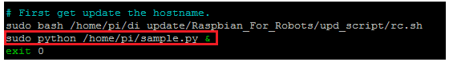
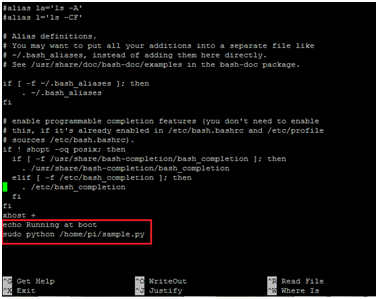

# linux command

## to remove files 

### remove all files in current folder
rm *

### remove all files and folders recurcivly in current folder
rm -r *

### remove all files in current directory with extention .pdf
rm *.pdf

### remove some selected files from current directory
rm file_name1 file_name2

## to remove Directory

### remove folder in current path
To delete a directory containing files, use rm -r.
rm -r dirname


### Remove mutiple folders
rm -r dirname1 dirname2 dirname3


## Lis files and directory

### list files and directory
ls

### list all hidden files and directory
ls -a

## display current path from Rooth
“pwd” command. It gives us the absolute path, which means the path that starts from the root

pwd

## moving accrees directory 

### If you just type “cd” and press enter, it takes you to the home directory.

cd

### go to folder , folder name is case sensitive
cd foldername

### if folder name have sapces then i.e Raspberry Pi then use **\** in place of sapce
cd Raspberry\ Pi

## create folder
Use the mkdir command when you need to create a folder
mkdir floderName

## carete a file
touch — The touch command is used to create a file.
touch test.txt

## halp command **man ** Diaplay user manual of command , & **--help** display way to use command

man dir

cd --help

## copying files 

### **cp** 
cp nand.txt /home/pi/project

## Moving and renaming file
Use the **mv** command to move files through the command line. We can also use the mv command to rename a file.

### renaming file
 
mv test1.txt test2.txt

### moving
mv test1.txt /home/pi/project/test2.txt

## view files
**cat** — Use the cat command to display the contents of a file. It is usually used to easily view programs.
cat test.txt

## **sudo** make changes as Admin 
**sudo** — A widely used command in the Linux command line, sudo stands for "SuperUser Do". So, if you want any command to be done with administrative or root privileges, you can use the sudo command.
sudo touch test.txt

## Check DIsk Space
df — Use the df command to see the available disk space in each of the partitions in your system. You can just type in df in the command line and you can see each mounted partition and their used/available space in % and in KBs. If you want it shown in megabytes, you can use the command “df -m”.

df

df -m

## clear screen
clear

## system Info
Using the command **uname -a** prints most of the information about the system. This prints the kernel release date, version, processor type, etc.

uname -a

## make executable program kind of **.exe**
Imagine you have a python code named numbers.py in your computer. You'll need to run **python numbers.py** every time you need to run it. Instead of that, when you make it executable, you'll just need to run **numbers.py** in the terminal to run the file. To make a file executable, you can use the command **chmod +x numbers.py** in this case.

chmod +x numbers.py

**Note**: Now when you list files using **ls** this file name color will be displayed green indicating it can be executed directly eith name

## HotName
Typing in **hostname -I** gives you your IP address in your network.
Typing in **hostname** gives you Name.

hostname -I

hostname

## Editing file in Vim (used to edit config files) Use sudo nano which is much easy to edit
```code
vim /etc/iscan/intscan.ini

Type "i" to enter insert mode.
Modify the value that you would like to change using the arrow keys on your keyboard.

Press ESC and then type ":wq!" then press Enter to save the changes and exit vim.
If you would like to exit the file without making any changes press ESC, then type ":q!" and press Enter.

pasting text in vim
Copy text
go in vim editor and right click mouce 

Visual mode starts 

Now pres shift and Incert should past text
```

## ping 

ping google.com  # ping globle IP DNS , press **ctrl + C** to close sending pkts 
ping 192.168.1.2 # ping local ip, press **ctrl + C** to close sending pkts 

# Stop any running command
press **Ctrl+C** can be used to stop any command in terminal safely.

# Exit terminal
You can exit from the terminal by using the exit command.

exit

# power off computer
You can power off or reboot the computer by using the command sudo halt and sudo reboot.

sudo reboot

## Remote commad
**Note** below command works only on **cmd.exe** and not on **putty** or **bash** 

### If you are on the remote machine:
scp user@hostname:D:\text.txt user@hostname:/etc/var/test/test.txt

### If you are currently on Windows machine:
scp C:\Users\ndhavalikar\Desktop\iestscp\test.txt pi@192.168.1.10:/home/pi/Project

### Copy all files and folders recursively from local to remote using scp
```code
C:\Users\ndhavalikar>scp -r C:\Users\ndhavalikar\Desktop\RespPiZero\server\* pi@192.168.1.10:/home/pi/Project/server/
pi@192.168.1.10's password:
bluezutils.py                                                                         100% 1612   159.2KB/s   00:00
cred.conf                                                                             100%   37     4.5KB/s   00:00
pyBleServer.py                                                                        100% 4522   368.6KB/s   00:00
sa.py                                                                                 100% 5665   499.9KB/s   00:00
piLib.py                                                                              100% 5080   376.8KB/s   00:00
__init__.py                                                                           100%   21     3.4KB/s   00:00
setup.py                                                                              100%  227    31.8KB/s   00:00
pyWifiServer.py                                                                       100% 4918   484.2KB/s   00:00
servernamePiCert.pem                                                                  100%  622    78.0KB/s   00:00
servernamePiPrivateKey.pem                                                            100%  232    32.0KB/s   00:00
```

### copy all file from windos folder to pi folder
scp C:\Users\ndhavalikar\Desktop\RespPiZero\server\* pi@192.168.1.10:/home/pi/Project/wifiBleServ


### File Permissions

- To view File Permission in folder

```code
 ls -l *
```

- To view File Permission 

```code
 ls -l test.py
```

- To change File Permission  to executable

```code
 sudo chmod +x test.py
```

- To change File Permission  to read,write,executable fll permission

```code
 sudo chmod 777 test.py
```

## Run Any script as in background as demon Manually

First give read ,write ,executable permission to log file
```code
sudo chmod 777 piLib.txt
```

```code

sudo nohup python /home/pi/Project/server/piLib/pilib/piLib.py > /home/pi/Project/server/piLib/pilib/piLib.txt 2>&1
```
## Autmatically Run a program on your raspberry-pi / Linux at startup , in background as demon


Some times its needed for script like python server  to be run automatically on Startup , without login in to sytem and  we start it manually. This can be achieved by any of below methods

```code

rc.local
.bashrc
init.d tab
systemd
crontab

```

1) rc.local
On your Pi, edit the file /etc/rc.local using the editor of your choice. You must edit it with root permissions:

```code
sudo nano /etc/rc.local
```
If your program runs continuously (runs an infinite loop) or is likely not to exit, you must be sure to fork the process by adding an ampersand (“&”) to the end of the command, like:

```code
sudo python /home/pi/sample.py &
```
The Pi will run this program at bootup, and before other services are started.  If you don’t include the ampersand and if your program runs continuously, the Pi will not complete its boot process. The ampersand allows the command to run in a separate process and continue booting with the main process running.Also, be sure to reference absolute file names rather than relative to your home folder. For example use `/home/pi/myscript.py` instead of `myscript.py`.

If you add a script into /etc/rc.local, it is added to the boot sequence. If your code gets stuck then the boot sequence cannot proceed. So be careful as to which code you are trying to run at boot and test the code a couple of times. You can also get the script’s output and error written to a text file (say log.txt) and use it to debug.
```code
sudo python /home/pi/sample.py & > /home/pi/Desktop/log.txt 2>&1
```


Be sure to leave the line exit 0 at the end, then save the file and exit. In nano, to exit, type Ctrl-x, and then Y.

Set Permission
```code
sudo chmod +x /etc/rc.local
sudo chmod +x yourScript.py
```
Now reboot the Pi to test it:
```code
sudo reboot
```

2) bashrc
The second method to run a program on your Raspberry Pi at startup is to modify the .bashrc  file. With the .bashrc method, your python program will run when you log in (which happens automatically when you boot up and go directly to the desktop) and also every time when a new terminal is opened, or when a new SSH connection is made. Put your command at the bottom of ‘/home/pi/.bashrc’. The program can be aborted with ‘ctrl-c’ while it is running!

```code
sudo nano /home/pi/.bashrc
``
`
Go to the last line of the script and add:

```code
echo Running at boot 
sudo python /home/pi/sample.py
```
