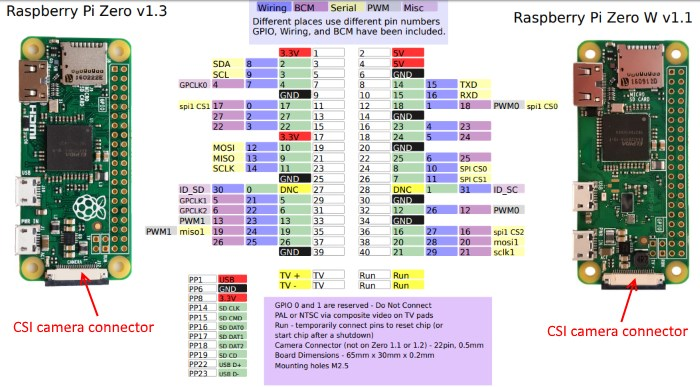
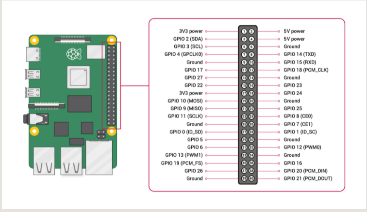
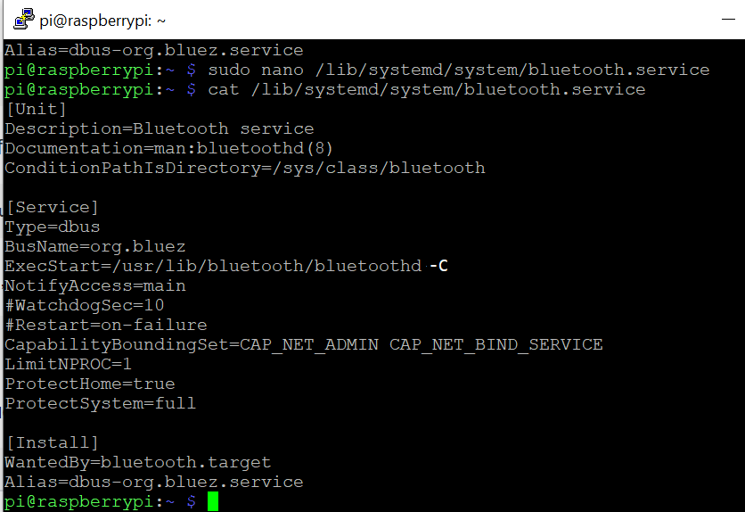
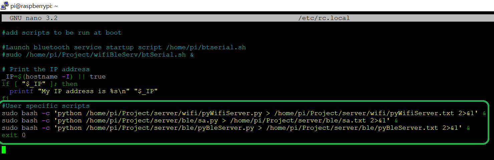

# Pi zero 

## Setup Hardware
- Format 8 GB sd card and install repbian OS with Basic graphis using image.exe utility
- inser SD card to pi and boot , check Destop , mouse  keyboard working.
- change respberry pi password
- Connect to wifi
- Go to Start - > Configurations -> Enable Needed Pheripherals -> Camera -> GPIO -> SSH etc save and reboot.

## Configure static ip address for repberry pi
On your LAN / WIFI local network, The private IP addresses of individual devices can change though, depending on the configuration of the DHCP server.
To be able to reach Raspberry Pi on the same address in your own LAN, you have to provide it with a static, private IP address. 

On Netger wifi rauter Login **192.168.1.1** with UN:admin, PW:password

On hatway ZTE wifi rauter Login **192.168.1.1** with UN:admin, PW:MACADDRESS without colon i.e(94E3EE04D430)

Select ADVANCED > Setup > LAN Setup. The LAN page displays. In the Address Reservation section, click the Add button.
Select IP , MAC  address you want save and restart RPi. 192.168.1.x. => 192.168.1.10.

Now from your open cmd and try > ping 192.168.1.10 , Rpi should respond

## Running SSH on Repberi Pi


Once login is success try below command in putty shell
```code
python3 --version 
```
## Install below modules  on pi via ssh

```code
sudo apt install bluetooth libbluetooth-dev
pip3 install pybluez
sudo apt install vim
```

## Raspberry Pi Info 

Note: the numbering of the GPIO pins is not in numerical order; GPIO pins 0 and 1 are present on the board (physical pins 27 and 28) but are reserved for advanced use (see below).



- Voltages
Two 5V pins and two 3V3 pins are present on the board, as well as a number of ground pins (0V), which are unconfigurable. The remaining pins are all general purpose 3V3 pins, meaning outputs are set to 3V3 and inputs are 3V3-tolerant.

- Outputs
A GPIO pin designated as an output pin can be set to high (3V3) or low (0V).

- Inputs
A GPIO pin designated as an input pin can be read as high (3V3) or low (0V). This is made easier with the use of internal pull-up or pull-down resistors. Pins GPIO2 and GPIO3 have fixed pull-up resistors, but for other pins this can be configured in software.

- More
As well as simple input and output devices, the GPIO pins can be used with a variety of alternative functions, some are available on all pins, others on specific pins.

    - PWM (pulse-width modulation)
    Software PWM available on all pins
    Hardware PWM available on GPIO12, GPIO13, GPIO18, GPIO19
    - SPI
    SPI0: MOSI (GPIO10); MISO (GPIO9); SCLK (GPIO11); CE0 (GPIO8), CE1 (GPIO7)
    SPI1: MOSI (GPIO20); MISO (GPIO19); SCLK (GPIO21); CE0 (GPIO18); CE1 (GPIO17); CE2 (GPIO16)
    - I2C
    Data: (GPIO2); Clock (GPIO3)
    - EEPROM Data: (GPIO0); EEPROM Clock (GPIO1)
    - Serial
    TX (GPIO14); RX (GPIO15)
    
Type below command to get all pins status.This tool is provided by the GPIO Zero Python library, which is installed by default on the Raspberry Pi OS desktop image, but not on Raspberry Pi OS Lite.
```code
pinout
```



Python script to read and write GPIO.To control an LED connected to GPIO17, and Button at GIO 2:
Note pin value passed as  parameter is GPIO no and not physical pin no , refer above diagram
```code
from gpiozero import LED, Button

led = LED(17)
button = Button(2)

while True:
    if button.is_pressed:
        led.on()
    else:
        led.off()
```

Use below command to edit Pheripheral configuration
```code
sudo nano /boot/config.txt
```

## Rpi WIFI Server 


### create server certs and python server script
    - Create Server CSR and get it signed by root CA. Refer Open SSL Document for creating same.
    - Keep Server Private key, Cert and python script in same folder in Rpi.

### Run WIFI Server in RPI

- copy all files from server/wifi to pi from pc (use CLI scp command for same).
- Make file Executable , File name change its color from gray to green.

```code
chmod +x pyWifiServer.py
```
- Run it

```code
sudo python pyWifiServer.py
```
- check if server is responding by below command

```code
https://192.168.1.10:5000/hello
crome may display site is unsafe but proceed (as cert is signed by self signed root crated by you)
```
- Now Test if server can be run in background as Demon task , go to root directory and try running server. this is to ensure that server runse even from root directory

```code
sudo nohup python /home/pi/Project/server/wifi/pyWifiServer.py &
```

- Now configure server in boot up task **rc.local** file (now on every boot server will be running)

```code
sudo nano /etc/rc.local
```

Add bleow lines at end just before exit 0

```code
#User specific scripts
sudo bash -c 'python /home/pi/Project/server/wifi/pyWifiServer.py > /home/pi/Project/server/wifi/pyWifiServer.txt 2>&1' &
```
- Now reboot RPi and check if server is running automatically on bootup

```code
sudo reboot
```
- Checking debug logs of server with below command all print and erros will be saved in below file
```code
cat /home/pi/Project/server/wifi/pyWifiServer.txt
```
- Now from your PC browser try connecting to server by 

```code
https://192.168.1.10:5000/hello
```

**Trouble shooting Wifi Server**
- Relative references of files (certificate and other files refereed in script) do not work when we run script from root (rc.local) so use complete path in script
- Server use port 5000. Server will not start if any program is using port 5000.Use below to check if any program is using port.
```code
    sudo lsof -i:5000
    or
    use below to kill
    sudo kill PID
    sudo kill 1234
```
- What if Wifi is not present will server start?
    
### Setup WIFI Soft AP on Rpi

TODO

### Setup BLE Server on Rpi

- Install Bluz

```code
sudo apt-get install bluez
sudo apt-get install pi-bluetooth 
```

Now edit below file and make sure Below is BLE discoverable always:

```code
sudo nano /etc/bluetooth/main.conf
and enale below lines
DiscoverableTimeout = 0
```

Now edit below file to run BLE in Compatibility mode:

```code
sudo nano /etc/systemd/system/dbus-org.bluez.service OR sudo nano /lib/systemd/system/bluetooth.service. Both are same.

change ExecStart=/usr/lib/bluetooth/bluetoothd to ExecStart=/usr/lib/bluetooth/bluetoothd -C
```




- copy all files from server/ble to pi from pc (use CLI scp command for same).
- Make file Executable , File name change its color from gray to green.

```code
chmod +x pyBleServer.py
chmod +x sa.py
```

check if Pairing agent (simple agent by bluz)can run in demon(baground)


```code
sudo nohup python /home/pi/Project/server/ble/sa.py &

```

Run and test Serial Port profile BLE python Server 

```code
sudo python /home/pi/Project/server/ble/pyBleServer.py
```

Now Its time to put sa.py and pyBleServer.py to rc.local so taht they can run on bootup

```code
sudo nano /etc/rc.local
```

Add bleow lines at end just before exit 0

```code
#User specific scripts
sudo bash -c 'python /home/pi/Project/server/ble/sa.py > /home/pi/Project/server/ble/sa.txt 2>&1' &
sudo bash -c 'python /home/pi/Project/server/ble/pyBleServer.py > /home/pi/Project/server/ble/pyBleServer.txt 2>&1' &
```



- Now reboot RPi and check if BLE server is running automatically on bootup

```code
sudo reboot
```
- Checking debug logs of server with below command all print and erros will be saved in below file

```code
cat /home/pi/Project/server/ble/pyBleServer.txt
cat /home/pi/Project/server/ble/sa.txt
```

- Now from your Android mobile try pairing Resp-pi BLE device it suld not ask any pass key and get paired.
- Now Use any Bluetooth Terminal software and try connecting to server , on sucessfull connection BLE server shuld ask for password enter "1234"
- Server should display menu
- You can use this to check IP address of Rpi , this IP then used for COnnecting to pi remotely over shell/Putty
- You can also set new SSID and PW and connect 

All Wifi configurations are stored in below and can be edited with below command

```code
sudo nano /etc/wpa_supplicant/wpa_supplicant.conf
```

**Trouble shoot Ble Server:**
- if serial profile is not set properly by pyBleServer.py , while connection Android terminal will throw error. thre is sleep(10) delay in script, before we set it (sudo sdptool add SP).

- use below to test BLE manually

```code
sudo nano bluetoothctl 
```

- use blow to restat both ble damon tasks  (sa.py and pyBleServer.py )

```code
sudo systemctl daemon-reload;
```

- To restart bluetooth service if needed
```code
sudo systemctl restart bluetooth.service;
```

## setting up mqtt on Rpi
https://www.youtube.com/watch?v=Pb3FLznsdwI