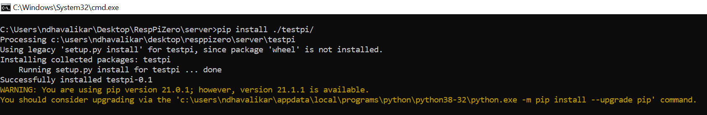

# Creating Python Pkg

## create .py file place it in filder "pkge name"
## create empty __ini__.py file
## add setup.py file place it outside pkg folder
## test pkage 
##Run pip command to install pkage


# more derais below

```code
Creating setup.py

If you have your package tree like,

foo
├── foo
│   ├── data_struct.py
│   ├── __init__.py
│   └── internals.py
├── README
├── requirements.txt
└── setup.py

Then, you do the following in your setup.py script so that it can be installed on some machine:

from setuptools import setup

setup(
   name='foo',
   version='1.0',
   description='A useful module',
   author='Man Foo',
   author_email='foomail@foo.com',
   packages=['foo'],  #same as name
   install_requires=['wheel', 'bar', 'greek'], #external packages as dependencies
)

Instead, if your package tree is more complex like the one below:

foo
├── foo
│   ├── data_struct.py
│   ├── __init__.py
│   └── internals.py
├── README
├── requirements.txt
├── scripts
│   ├── cool
│   └── skype
└── setup.py

Then, your setup.py in this case would be like:

from setuptools import setup

setup(
   name='foo',
   version='1.0',
   description='A useful module',
   author='Man Foo',
   author_email='foomail@foo.com',
   packages=['foo'],  #same as name
   install_requires=['wheel', 'bar', 'greek'], #external packages as dependencies
   scripts=[
            'scripts/cool',
            'scripts/skype',
           ]
)

Add more stuff to (setup.py) & make it decent:

from setuptools import setup

with open("README", 'r') as f:
    long_description = f.read()

setup(
   name='foo',
   version='1.0',
   description='A useful module',
   license="MIT",
   long_description=long_description,
   author='Man Foo',
   author_email='foomail@foo.com',
   url="http://www.foopackage.com/",
   packages=['foo'],  #same as name
   install_requires=['wheel', 'bar', 'greek'], #external packages as dependencies
   scripts=[
            'scripts/cool',
            'scripts/skype',
           ]
)

The long_description is used in pypi.org as the README description of your package.
```