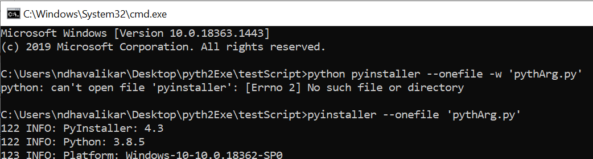

# Convering .py to .exe
When you want everyone to run your Python script without the installation of Python, So for this work, you can convert the .py file to .exe file. I Follow the below steps for the same. 

## Install Tool
- Install the library pyinstaller. 

```code
pip install pyinstaller
```

## Build .exe from Python Script

Go into the directory where your ‘.py’ file is located. open cli . 

```code
pyinstaller --onefile pythArg.py
```

Above command will generate some files and folders. **build** folder and **pythArg.spec** is of no use. You can delete these if you want, it will not affect your ‘.exe’ file. Open **dist** folder above. Here you will get your ‘.exe’ file. 

## Run .exe File


